| Nama      | Aditya Bani Isro |
| ----------- | ----------- |
| NIM     | 312010134       |
| Kelas   | TI.20.A.1        |

# Praktikum 3 | Membuat List, Table dan Form

# DAFTAR TUGAS

<table border="2" cellpading="10">
  <tr>
    <td><b>Praktikum 1</b></td>
    <td>HTML Dasar</td>
    <td><a href="https://github.com/Aditya-Bani/lab1web">Klik disini</td>
  </tr>
  <tr>
    <td><b>Praktikum 2</b></td>
    <td>CSS Dasar</td>
    <td><a href="https://github.com/Aditya-Bani/lab2web">Klik disini</td>
  </tr>
  <tr>
    <td><b>Praktikum 3</b></td>
    <td>Membuat List, Table dan Form</td>
    <td><a href="https://github.com/Aditya-Bani/lab3web">Klik disini</td>
  </tr>
  <tr>
    <td><b>Praktikum 4</b></td>
    <td>CSS Layout</td>
    <td><a href="https://github.com/Aditya-Bani/lab4web">Klik disini</td>
  </tr>
  <tr>
  <td><b>Praktikum 5</b></td>
    <td>Javascript</td>
    <td><a href="https://github.com/Aditya-Bani/lab5web">Klik disini</td>
</tr>
<tr>
  <td><b>Praktikum 6</b></td>
    <td>Web Framework</td>
    <td><a href="https://github.com/Aditya-Bani/lab6web">Klik disini</td>
</tr>
<tr>
  <td><b>Praktikum 7</b></td>
    <td>PHP Dasar</td>
    <td><a href="https://github.com/Aditya-Bani/lab7web">Klik disini</td>
</tr>
<tr>
  <td><b>Praktikum 8</b></td>
    <td>PHP dan Database MySQL</td>
    <td><a href=https://github.com/Aditya-Bani/lab8web">Klik disini</td>
</tr>
<tr>
  <td><b>Praktikum 9 & 10</b></td>
    <td>PHP Modular</td>
    <td><a href="https://github.com/Aditya-Bani/lab9web">Klik disini</td>
</tr>
<tr>
  <td></td>
    <td>PHP OOP</td>
    <td><a href="https://github.com/Aditya-Bani/lab10web">Klik disini</td>
</tr>
<tr>
    <td><b>Praktikum 11</b></td>
    <td>PHP Framework (Codeigniter)</td>
    <td><a href="https://github.com/Aditya-Bani/lab11web">Klik disini</td>
  </tr>
<tr>
    <td><b>Praktikum 12</b></td>
    <td>Framework Lanjutan (CRUD)</td>
    <td><a href="https://github.com/Aditya-Bani/lab11web">Klik disini</td>
  </tr>
<tr>
    <td><b>Praktikum 13</b></td>
    <td>Framework Lanjutan (Modul Login)</td>
    <td><a href="https://github.com/Aditya-Bani/lab11web">Klik disini</td>
  </tr>
  <tr>
    <td><b>Praktikum 14</b></td>
    <td>Pagination dan Pencarian</td>
    <td><a href="https://github.com/Aditya-Bani/lab11web">Klik disini</td>
  </tr>
  <tr>
</table>_________________________________________________________________________________
_________________________________________________________________________________

### Langkah-langkah praktikum
Membuka Text Editor, disini saya menggunakan Visual Studio Code
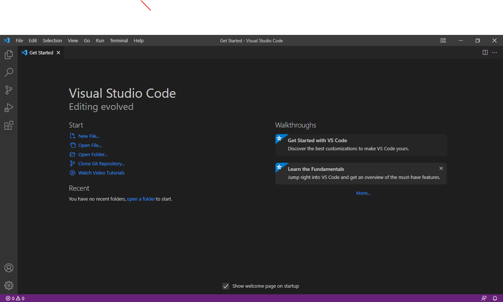

Persiapan membuat dokumen HTML dengan nama file lab3_list.html seperti berikut.
```
<!DOCTYPE html>
<html lang="en">
<head>
    <meta charset="UTF-8">
    <meta name="viewport" content="width=device-width, initial-scale=1.0">
    <title>HTML Lanjutan</title>
</head>
<body>
    <header>
        <h1>Membuat List</h1>
    </header>
</body>
</html>
```

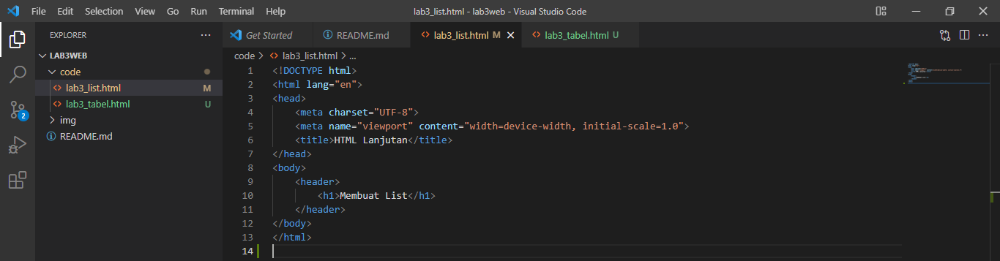

### Membuat Ordered List
Kemudian tambahkan kode untuk membuat Ordered List seperti berikut.
```
<section id="order-list">
    <h2>Ordered List</h2>
    <ol>
        <li>Pemrograman Web</li>
        <li>Sistem Informasi</li>
        <li>Basis Data 2</li>
    </ol>
</section>
```

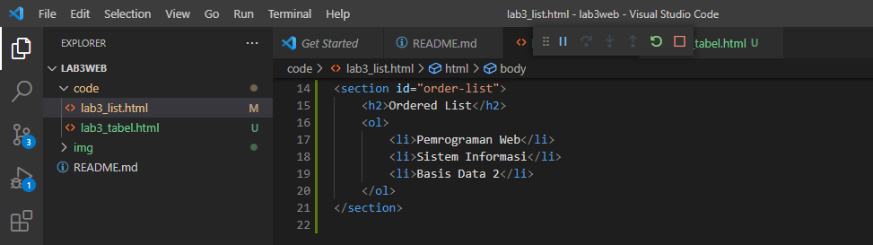

Output

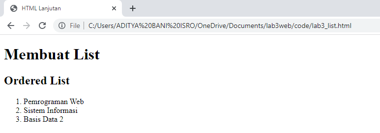

### Membuat Unorderd List
Kemudian tambakan kode untuk membuat Unordered List, setelah deklarasi ordered list pada 
section unordered-list, seperti berikut.
```
<section id="unorder-list">
    <h2>Unordered List</h2>
    <ul type="square">
        <li>Jaringan Komputer</li>
        <li>Struktur Data</li>
        <li>Algoritma &amp; Pemrograman</li>
    </ul>
</section>
```

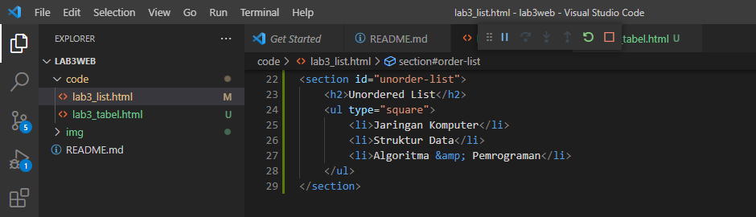

Output

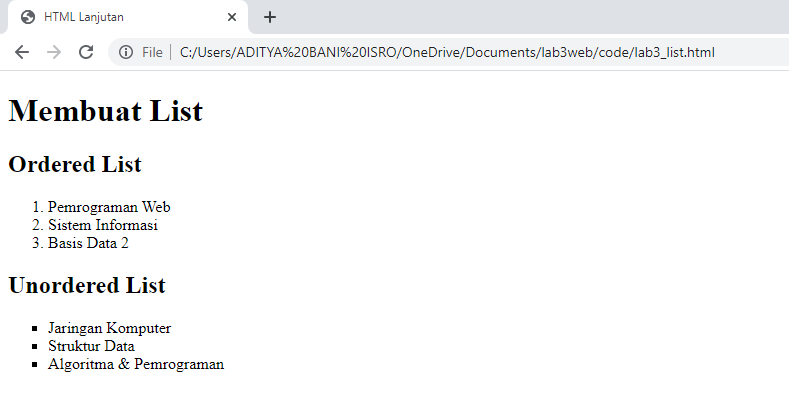

### Membuat Description List
Kemudian tambahkan kode untuk membuat description list setelah deklarasi unorderd-list.
```
<section id="unorder-list">
    <h2>Description List</h2>
    <dl>
        <dt>Fakultas Teknik</dt>
        <dd>Teknik Industri</dd>
        <dd>Teknik Informatika</dd>
        <dd>Teknik Lingkungan</dd>
        <dt>Fakultas Ekonomi dan Bisnis</dt>
        <dd>Akuntansi</dd>
        <dd>Manajemen</dd>
        <dd>Bisnis Digital</dd>
    </dl>
</section>
```

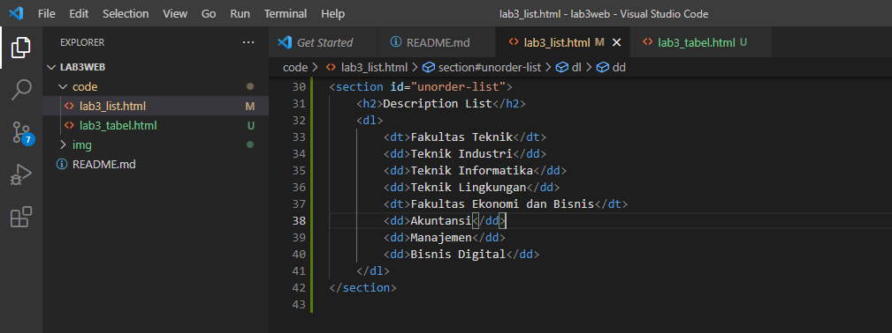

Output

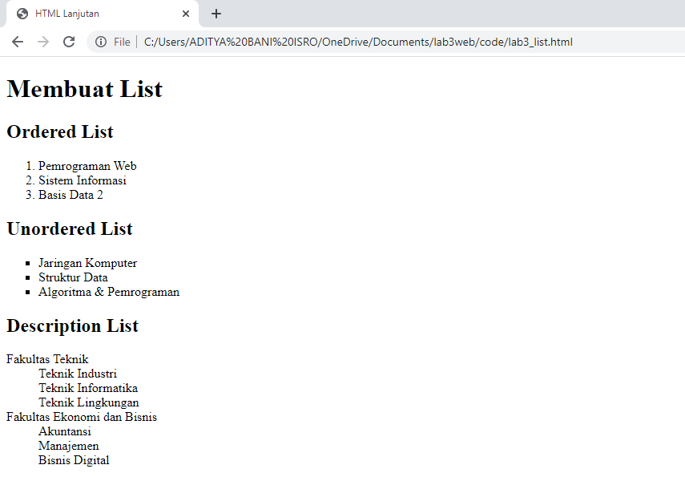

### Membuat Tabel
Buat file baru dengan nama lab3_tabel.html seperti berikut.
```
<!DOCTYPE html>
<html lang="en">
<head>
    <meta charset="UTF-8">
    <meta name="viewport" content="width=device-width, initial-scale=1.0">
    <title>HTML Lanjutan</title>
</head>
<body>
    <header>
        <h1>Membuat Table</h1>
    </header>
</body>
</html>
```

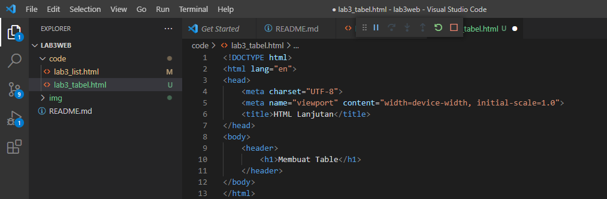

```
<table border="1" cellpadding="6" cellspacing="0">
    <thead>
        <tr>
            <th>No.</th>
            <th>Fakultas</th>
            <th>Program Studi</th>
        </tr>
    </thead>
    <tbody>
        <tr>
            <td>1.</td>
            <td rowspan="3">Teknik</td>
            <td>Teknik Informatika</td>
        </tr>
        <tr>
            <td>2.</td>
            <td>Teknik Industri</td>
        </tr>
        <tr>
            <td>3.</td>
            <td>Teknik Lingkungan</td>
        </tr>
    </tbody>
</table>
```

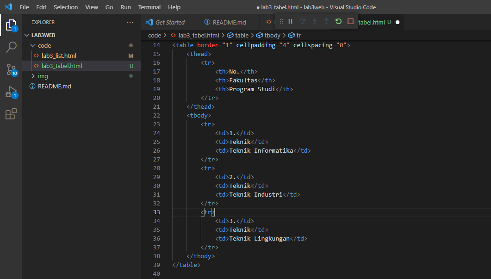

### Mengatur Margin dan Padding
Untuk mengatur margin dan padding pada cel data, tambahkan atribut cellpadding dan 
cellspacing pada tag table.
```
<table border="1" cellpadding="4" cellspacing="0">
```


Output

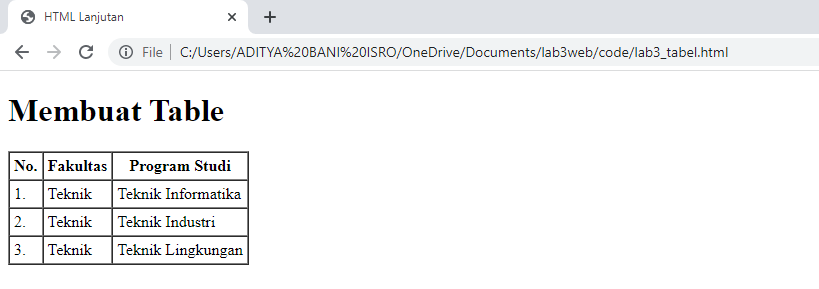

### Menggabungkan Sell Data
Untuk menggabungkan sel data, gunakan atribut rowspan dan colspan. Atribut rowspan untuk 
menggabungkan baris (secara vertikal) dan colspan untuk menggabungkan kolom (secara 
horizontal).
```
<table border="1" cellpadding="6" cellspacing="0">
    <thead>
        <tr>
            <th>No.</th>
            <th>Fakultas</th>
            <th>Program Studi</th>
        </tr>
    </thead>
    <tbody>
        <tr>
            <td>1.</td>
            <td rowspan="3">Teknik</td>
            <td>Teknik Informatika</td>
        </tr>
        <tr>
            <td>2.</td>
            <td>Teknik Industri</td>
        </tr>
        <tr>
            <td>3.</td>
            <td>Teknik Lingkungan</td>
        </tr>
    </tbody>
</table>
```

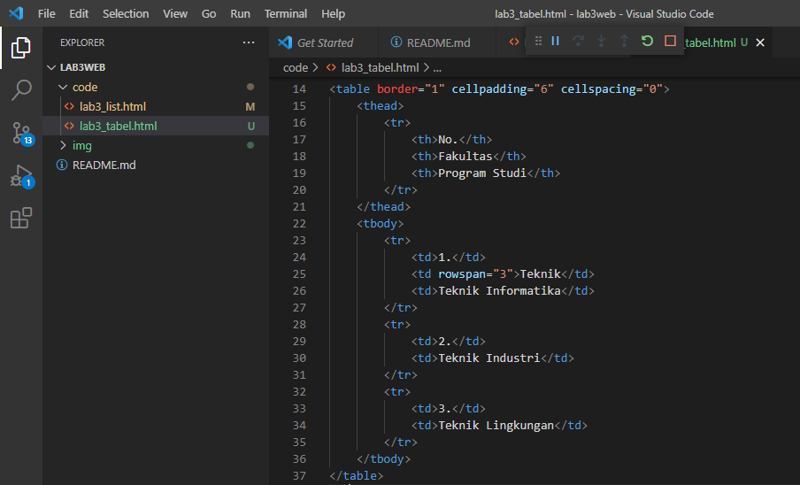

Output

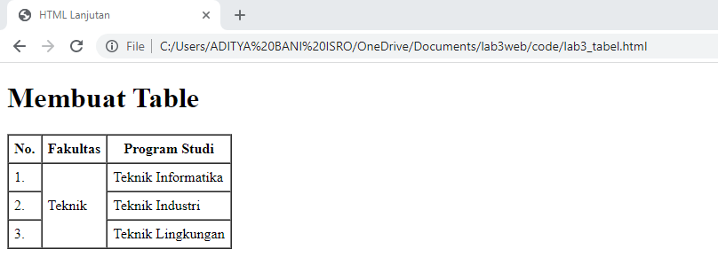

### Membuat Form
Buat file baru dengan nama lab3_form.html seperti berikut
```
<!DOCTYPE html>
<html lang="en">
    <head>
        <meta charset="UTF-8">
        <meta name="viewport" content="width=device-width, initial-scale=1.0">
        <title>HTML Lanjutan</title>
    </head>
    <body>
        <header>
            <h1>Membuat Form</h1>
        </header>
    </body>
</html>
```

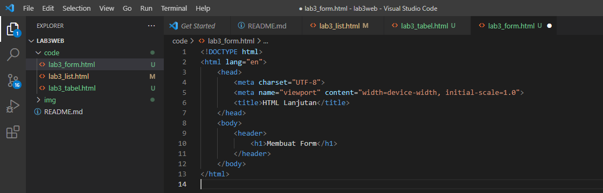

Kemudian selanjutnya tambahkan kode untuk membuat tabel sederhana seperti berikut:
```
<form action="proses.php" method="post">
    <fieldset>
        <legend>Data Pelanggan</legend>
        <p>
            <label for="nama">Nama</label>
            <input type="text" id="nama" name="nama">
        </p>
        <p>
            <label for="alamat">Alamat</label>
            <textarea id="alamat" name="alamat" cols="20" rows="3"></textarea>
        </p>
        <p>
            <label>Jenis Kelamin</label>
            <input id="jk_l" type="radio" name="kelamin" value="L" /><label
            for="jk_l">Laki-laki</label>
            <input id="jk_p" type="radio" name="kelamin" value="P" /><label
            for="jk_p">Perempuan</label>
        </p>
        <p><input type="submit" value="Login"></p>
    </fieldset>
</form>
```

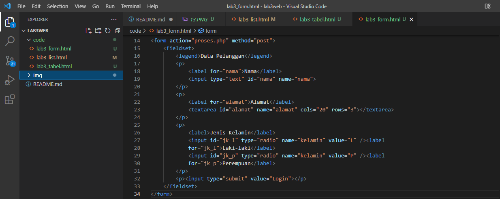

Output

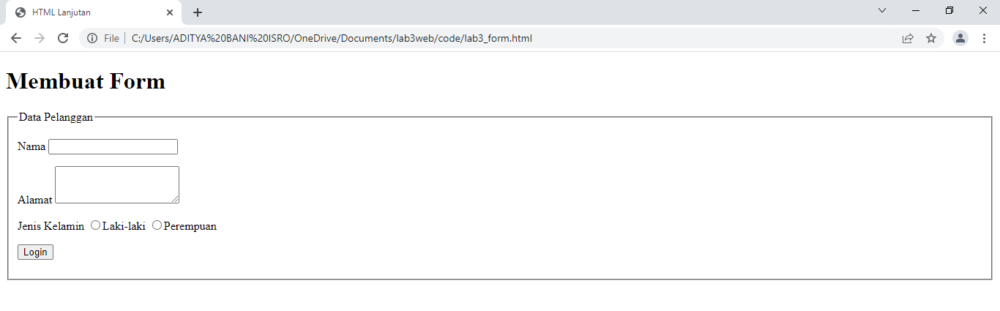

### Menambahkan Style Pada Form
Agar tampilan form lebih menarik, bisa ditambahkan CSS seperti berikut.
```
<style>
form p > label {
    display: inline-block;
    width: 100px;
}
form input[type="text"], form textarea {
    border: 1px solid #197a43;
}
form input[type="submit"] {
    border: 1px solid #197a43;
    background-color: #197a43;
    color: #ffffff;
    font-weight: bold;
    padding: 5px 15px;
}
</style>
```

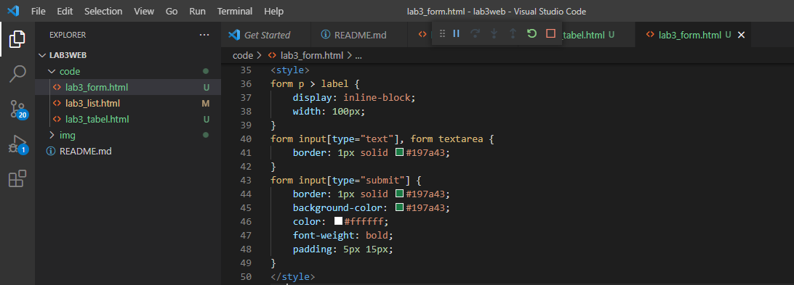

Output

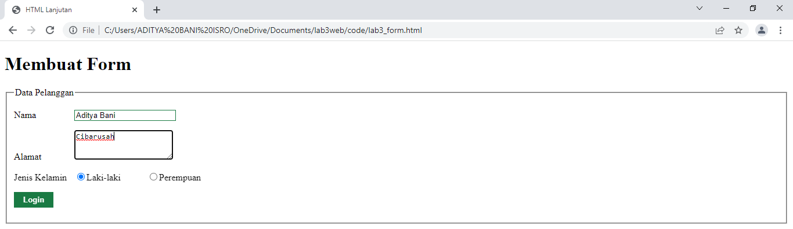


## Pertanyaan Dan Tugas
1. Buatlah form yang menampilkan dropdown menu dan listbox dengan multiple selection.

## Jawaban
1. HTML
```
<!DOCTYPE html>
<html>
  <head>
    <meta charset="utf-8">
    <meta name="viewport" content="width=device-width, initial-scale=1">
    <title>Form dropdown & Listbox with multiple selection</title>
    <link rel="stylesheet" type="text/css" href="assets/css/style.css">
  </head>
  <body>
    <div class="header">
      <div>
        
      </div>
      <div>
        <h1>Form UPB</h1>
      </div>
    </div>
    <form action="proses.php" method="post">
      <fieldset>
        <legend>Data Mahasiswa</legend>
        <label for="nama">Nama</label>
        <input type="text" id="nama" name="nama">
        <label for="nim">NIM</label>
        <input type="text" id="nim" name="nim">
        <label for="jurusan">Jenis Kelamin</label>
        <input id="jk_l" type="radio" name="kelamin" value="L" />
        <label for="jk_l">Laki-laki</label>
        <input id="jk_p" type="radio" name="kelamin" value="P" />
        <label for="jk_p">Perempuan</label>
        <br>
        <br>
        <label for="jurusan">Jurusan(Dropdown)</label>
        <select name="jurusan">
          <option value="" selected="selected">--Pilih Jurusan--</option>
          <option value="ti">Teknik Informatika</option>
          <option value="ts">Teknik Sipil</option>
          <option value="mj">Manajemen</option>
        </select>
        <br>
        <label for="jurusan2">Jurusan (multiple selection)</label>
        <select multiple name="drawfs" id="jurusan">
          <option value="ti">Teknik Informatika</option>
          <option value="ts">Teknik Sipil</option>
          <option value="mj">Manajemen</option>
        </select>
        <br>
        <label for="alamat">Alamat</label>
        <textarea id="alamat" name="alamat" cols="20" rows="3"></textarea>
        <p>
          <input type="submit" value="Daftar">
        </p>
      </fieldset>
    </form>
  </body>
</html>
```

2. CSS STYLE
```
body{
	margin: 2% auto;
	width: 40%;
	font-family: arial;
	font-size: 17px;
	line-height: 25px;
}
.header{
	display: flex;
	align-items: center;	
	justify-content: flex-start;
}
.logo{
	width: 110px;
}
form > label {
	display: inline-block;
    width: 100px;
}
form input[type="text"],
form select, 
form textarea { 
	border: 1px solid #197a43;
	width: 100%;
  padding: 6px 10px;
  margin: 3px 0;
  box-sizing: border-box;
  font-size: 15px;
}
form input[type="submit"] {
  border: 5px solid #04AA6D;
	background-color: #04AA6D; 
	color: #ffffff;
	padding: 5px 15px;
	border-radius: 10px;
	font-size: 15px;
}
select {
  width: 100%;
  height: 30px;
  padding: 16px 20px;
  border: none;
  border-radius: 4px;
  background-color: #fff;
}
#jurusan{
	height: 60px;
}
@media only screen and (max-width: 760px) {
  body {
    width: 90%;
  }
}
```

Output

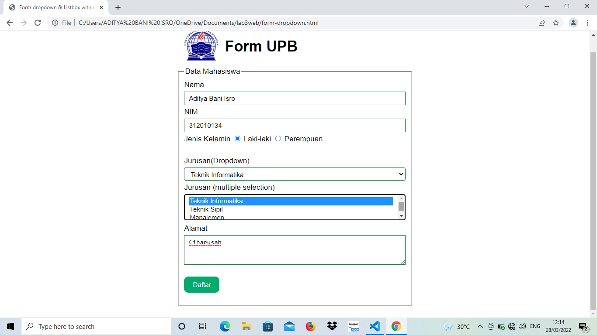
